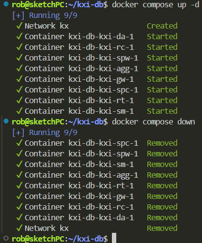
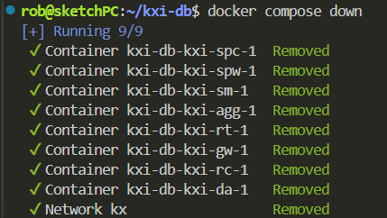
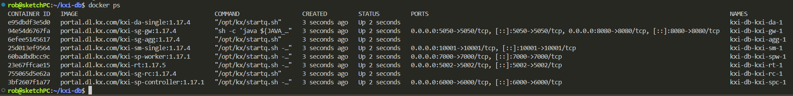

# KXI SDK Final Project

This repository provides an example of a KX Insights SDK application which ingests and stores raw trade data in addition to interval OHLC analytics from a dummy data feed written in q.

# Deploy

In order to deploy this application, you can pull this repo and then run the following commands to create the directory structure for your database:

```
# create db directories
mkdir -p data/logs/rt data/db data/sp
# allow for reads and writes to db
chmod -R 777 data
```

You can start the application/pipeline using docker compose
```
# start application
docker compose up -d
# stop application
docker compose down 
```





You can also check the status of the containers running the configured KXI services using docker ps



# Stream Processor

In this app, I utilize a stream processor architecture to capture dummy trade data for Apple (AAPL) and store this data to a KXI database.  Additionally, the pipeline splits and generates OHCL interval analytics with 10 second periods. The spec for this stream processor can be found in the config/src/trade_spec.q script.

Upon starting this application, you can query the data which has been fed through RT to the database with the following queries:

```
q)10#last h(`.kxi.getData;enlist[`table]!enlist`trade;`;()!())
time                          spTime                        sym  price    size side
-----------------------------------------------------------------------------------
2026.02.17D14:07:22.367906587 2026.02.17D14:07:22.367915978 AAPL 199.8578 500  SELL
2026.02.17D14:07:22.468180877 2026.02.17D14:07:22.468196614 AAPL 199.8745 700  SELL
2026.02.17D14:07:22.567385537 2026.02.17D14:07:22.567403545 AAPL 199.7687 500  SELL
2026.02.17D14:07:22.667718538 2026.02.17D14:07:22.667736095 AAPL 199.8955 800  BUY 
2026.02.17D14:07:22.768073334 2026.02.17D14:07:22.768091523 AAPL 199.9833 1000 BUY 
2026.02.17D14:07:22.867439855 2026.02.17D14:07:22.867457555 AAPL 200.0611 900  SELL
2026.02.17D14:07:22.967711826 2026.02.17D14:07:22.967728396 AAPL 200.0054 800  SELL
2026.02.17D14:07:23.068063508 2026.02.17D14:07:23.068082177 AAPL 200.1463 300  BUY 
2026.02.17D14:07:23.168399679 2026.02.17D14:07:23.168415473 AAPL 200.2685 500  BUY 
2026.02.17D14:07:23.267692889 2026.02.17D14:07:23.267713158 AAPL 200.4117 800  BUY 
q)
```

```
q)10#last h(`.kxi.getData;enlist[`table]!enlist`ohlc;`;()!())
time                          spTime                        sym  high     low      open     close    volume
-----------------------------------------------------------------------------------------------------------
2026.02.17D14:07:32.268145834 2026.02.17D14:07:32.268162040 AAPL 201.1157 199.7687 199.8578 200.0584 58100 
2026.02.17D14:07:42.267498796 2026.02.17D14:07:42.267514503 AAPL 200.1088 199.0174 199.8809 199.5034 51300 
2026.02.17D14:07:52.267524986 2026.02.17D14:07:52.267541414 AAPL 199.8101 198.808  199.361  199.1621 54300 
2026.02.17D14:08:02.268455254 2026.02.17D14:08:02.268474469 AAPL 200.825  199.1991 199.3531 200.6345 51100 
2026.02.17D14:08:12.267912848 2026.02.17D14:08:12.267929005 AAPL 200.8989 200.1336 200.6024 200.4701 51900 
2026.02.17D14:08:22.268196059 2026.02.17D14:08:22.268213076 AAPL 201.1464 199.7073 200.4799 199.8917 60300 
2026.02.17D14:08:32.267842518 2026.02.17D14:08:32.267857933 AAPL 201.1482 198.7224 200.0675 198.7224 57300 
2026.02.17D14:08:42.390814357 2026.02.17D14:08:42.390830022 AAPL 199.6101 198.6721 198.7549 199.2066 50100 
2026.02.17D14:08:52.268315141 2026.02.17D14:08:52.268331195 AAPL 200.0193 198.078  199.1219 198.6141 56300 
2026.02.17D14:09:02.268356578 2026.02.17D14:09:02.268375056 AAPL 198.9288 196.4477 198.7511 196.6396 58900 
q)
```
